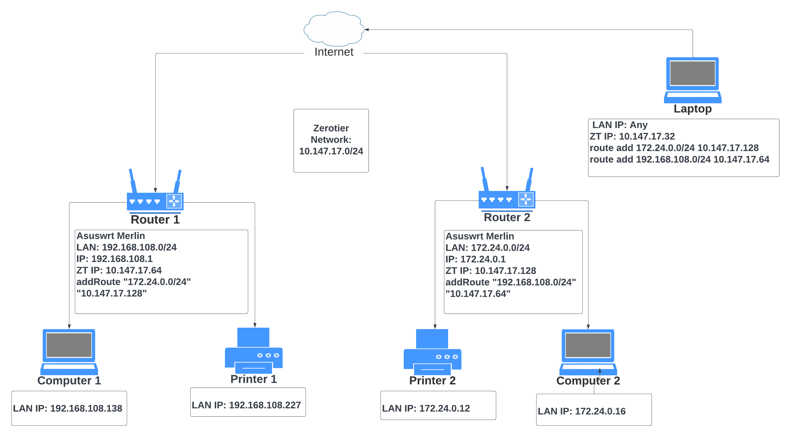

# Installing Zerotier on Asus-WRT Merlin

Follow this guide to install Zerotier on your Asus router with Asus-WRT
Merlin. This will enable you to securely access the router itself and
other devices on your lan from any device on your Zerotier network.

## Prerequisites
You will need an Asus router that is [compatible with Asus-WRT
Merlin](https://www.asuswrt-merlin.net) and with the latest stable version
installed. This guide has been tested with the following routers: RT-AC68U,
RT-AC86U, RT-AX86U, and RT-AX86U Pro.

You need to be comfortable with using shell commands over SSH. Make sure SSH,
jffs, and entware are installed. See [the Merlin
Wiki](https://github.com/RMerl/asuswrt-merlin.ng/wiki) for help. It is
recommended to use a [unique IP
range](#use-a-distinct-and-unique-ip-range-for-your-router) on your
router. Don't use the default.

## Install Zerotier
If you don't already have a Zerotier account, you can sign up for one here:
https://www.zerotier.com/, then `Create a Network`. Click on your network and
make a note of the Network ID. By default, it will assign you a network IP range
with Auto-Assign selected. You can change this range if you want. It makes
things easier if you choose a range that you can easily discern from your LAN's
range at a glance.

SSH in to the router to install Zerotier. If you have an RT-AC68U, version 1.4.6
has been shown to perform the best, so execute the following command: `opkg
install
http://bin.entware.net/armv7sf-k2.6/archive/zerotier_1.4.6-5_armv7-2.6.ipk`.  If
you have any other router, the latest entware version is fine. So use these
commands:

```
opkg update
opkg install zerotier
```
And then,
```
# Start TUN
modprobe tun

# Start zerotier service
zerotier-one -d

# Check service status.
zerotier-cli info

# Response should be:
# 200 info [NODE-ID] [Zerotier-version] ONLINE
```

## Join the zerotier network

If you have 0.0.0.0/0 in your zerotier Managed Routes, it would be adviseable to
temporarily remove it until you have finished the installation. Some people have
reported that the next command could cause the router to disconnect from the
Internet if that route is present.

```
zerotier-cli join <Network ID>

```

Now go to your network page on `my.zerotier.com`. You should find your NODE-ID
(returned from `zerotier-cli info` above) listed as an unauthorized member in the list
of network members. Click in the checkbox on the left to authorize it. Then, if
you have IP4 Auto-Assign turned on, you should see the IP address populate. This
is your router's address on your zerotier network. You can change it at this
time if you like. Again, you might want to give it a distinctive IP, such as
`xxx.xxx.xxx.1`.

Test the network. It may or may not work at this point, because the `iptables` have not yet been set up.
```
ping <ip address of another node in your zerotier network> -c 4
```

Ping without '-c 4' or terminated by `ctrl-c` may cause zerotier to crash
because of a long-standing bug. If it crashes, run `zerotier-one -d` again.

## Install scripts

The scripts here will be used to set up `iptables` so that zerotier packets
are correctly routed to and from your LAN. They will also work around some
router OS issues to ensure your zerotier daemon stays running.

Clone this repository, then edit `scripts/lan-route-table.sh` to change
`baseZTRoute` to your zerotier network IP range.

Then copy the scripts to the appropriate place in your router:
```
scp -p init.d/* asus:/opt/etc/init.d
scp -p scripts/* asus:/jffs/scripts
```

Restart your router.

## Connect to the router and lan clients

Once the router comes back up, the `ping` command above should work. (If you
stop ping with CTRL-C now it may kill the zerotier daemon but because our
scripts are now installed, it should restart shortly.) Now you should be able to
connect to the router from another client on your zerotier network via SSH or
Web GUI using the router's zerotier IP address. To connect to LAN clients from
outside, just use their LAN IP address. In order to do this, you'll have to set
up a custom route on your zerotier clients outside the LAN. The way to do this
depends on the OS of your client, but for example, the command on MacOS is `sudo
route add <LAN IP range> <zerotier router IP>`. It may be tempting to add the
route to `Managed Routes` in your zerotier dashboard, but [we recommend against
that](#dont-use-zerotier-managed-routes).

## Connect two LANs

You can securely connect two (or more) LANs to each other using zerotier. You
simply configure each router as above, but additionally, when editing
`scripts/lan-route-table.sh`, uncomment `addRoute` and change it to a route to
the opposite LAN. When you add the route in this way, you don't have add routes
to each host in the LAN. The router will take care of it.

Below is a diagram showing how a host can print using a printer in another
LAN. On Computer 1 or the Laptop, simply add 172.24.0.12 as a printer and print.



## Full Tunnel Mode

You can use zerotier like a traditional VPN. By turning on "allow Default Route"
in a mobile client's zerotier app, you can encrypt and redirect all its internet
traffic through your home router. Follow these steps:

1. Change the value of the FULL_TUNNEL variable to `"yes"` in `/jffs/scripts/lan-route-table.sh`
and reboot the router.
2. In your Zerotier console, add a managed route for `0.0.0.0/0` via your router's Zerotier IP.
3. In your client, enable full tunnel mode. If your client has a Zerotier GUI
   (Mac, Windows, iOS, Android), you should be able to find a configuration
   option labeled *allow Default Route*, *Route all traffic through Zerotier*,
   or something like that. If you don't have a GUI (Linux), execute  `sudo
   zerotier-cli set <networkId> allowDefault=1`. For Linux you may also need to
   set `rp_filter`.

See [this page for further
information](https://zerotier.atlassian.net/wiki/spaces/SD/pages/7110693/Overriding+Default+Route+Full+Tunnel+Mode). [Also see this...](https://www.digitalocean.com/community/tutorials/getting-started-software-defined-networking-creating-vpn-zerotier-one)

## Hints and Tips:
#### Don’t use Zerotier Managed Routes
 Managed Routes are propagated to all zerotier clients, and will likely install
 inappropriate routes on your router that may cause inefficiencies or
 worse.
#### Don’t nest Zerotier installations

Don’t install zerotier on a router that is a client of your main router. If
there is more than one route to a zerotier client, that could cause
trouble. Also, if you have a computer in the LAN that has a zerotier
installation, you should disconnect it in the GUI. Newer versions of Zerotier
can deal with this situation better, but be aware that it could be troublesome.

#### Use a distinct and unique IP range for your router

In particular, avoid 192.168.0.x and 192.168.1.x, as these are the default on
many routers. If you want to access your LAN from a zerotier client in another
LAN with the same IP range, you could run into problems.


## Additional Information:
Extended discussions and troubleshooting hints are available on the [Small Network Builder Forums.](
https://www.snbforums.com/threads/a-guide-about-installing-zerotier-on-asus-ac68u-router.42648/)
